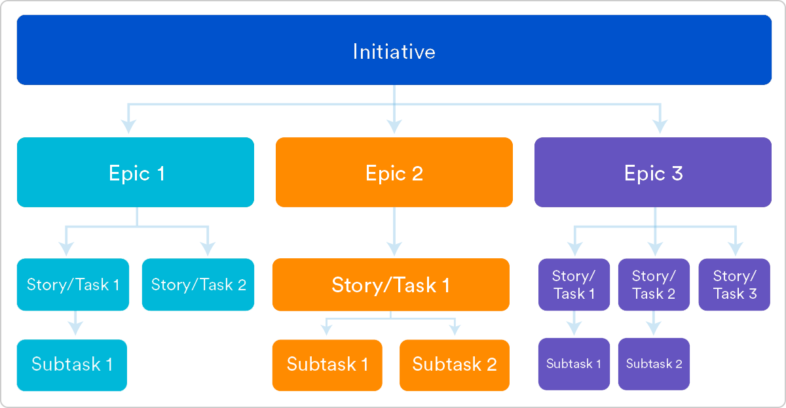

# 1. ОПРЕДЕЛЕНИЕ СТРУКТУРЫ ЗАДАЧ ПРОЕКТА  

*Примечания:*  
*[Текст, заключенный в квадратные скобки, включен в качестве руководства для автора и должен быть удален перед публикацией документа].*  

Перечень разделов и форматов представления информации является рекомендуемым, может быть изменен автором документа по своему усмотрению.  
Для отрисовки блок-схем, диаграмм рекомендовано использовать продукт draw.io. Ссылка на веб-версию: https://app.diagrams.net/, ссылка на скачивание desktop-версии: https://github.com/jgraph/drawio-desktop/releases/tag/v18.1.3.

*[Как известно, пользовательская история (User story) – это наименьшая единица работы в методике Agile. Пользовательские истории объединены в эпики (Epic), а те в свою очередь – в инициативы (Initiative).*  
*Первым этапом необходимо структурировать элементы бэклога проекта, выделив инициативу, эпики и сформулировав пользовательские истории.*  
*Пользовательские истории не должны один в один совпадать с функциональными требованиями, выделенными в Спринте 1, однако должны коррелировать с ними в той или иной степени.*  
*Шаблон результата приведен ниже (уровень детализации – до уровня историй). При необходимости, схему можно дополнить словесным описанием.*  
*Пример нумерации эпиков и историй: 1. Номер эпика, 1.1., 1.2, … 1.N – Номер историй в рамках эпика и т.д.]*  

Рисунок 1 – Структура задач Agile-проекта