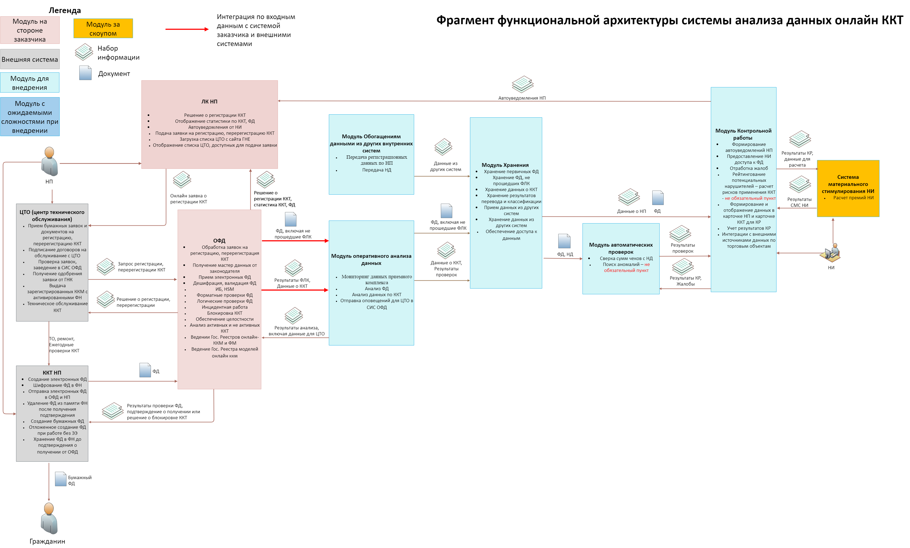

# 3. ОПИСАНИЕ ФУНКЦИОНАЛЬНОЙ АРХИТЕКТУРЫ  

*Примечания:*  
*[Текст, заключенный в квадратные скобки, включен в качестве руководства для автора и должен быть удален перед публикацией документа].*  
Перечень разделов и форматов представления информации является рекомендуемым, может быть изменен автором документа по своему усмотрению.  
Для отрисовки блок-схем, диаграмм рекомендовано использовать продукт draw.io. Ссылка на веб-версию: https://app.diagrams.net/, ссылка на скачивание desktop-версии: https://github.com/jgraph/drawio-desktop/releases/tag/v18.1.3.

*[После того, как определены основные эпики, истории и их приоритет, необходимо визуализировать функциональную архитектуру продукта.*  
*Для этого: выделите основные модули продукта (соответствующие эпикам или историям), обозначьте связи между ними, а также связь продукта с внешними системами, укажите основных пользователей или actor’ов.*  
*Итоговый результат должен быть аналогичен рисунку ниже. Желательно дополнить схему архитектуры легендой.*  
*Для визуализации рекомендуется использовать инструмент draw.io, ссылки на который даны в начале документа].*  

Рисунок 2 – Функциональная архитектура продукта